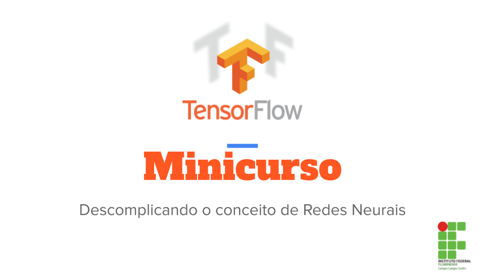

# Minicurso TensorFlow
Bem vindo ao minicurso de TensorFlow básico, neste repositório você encontrará todo o material utilizado no minicurso durante a Semana de Integração de engenharias promovido pelo Instituto Federal Fluminense Campus Campos Centro.

## Tópicos abordados no minicurso

* Aprender sobre o conceito de ML e Deep Learning
* Entender o que é uma rede neural, seus tipos e como começar
* Entender o que é o TensorFlow e como ele trabalha
* Estudo de caso: Classificando imagens de roupas com o Keras
* Estudo de caso 2: ML aplicado ao diagnóstico de câncer
* Bônus - ML para embarcados: Criando o modelo e carregando em um esp32
*  Dicas de livros
*  Dicas de curso
*  Dica de setup para começar a desenvolver
*  Aplicações de IA
*  Curiosidade: É possível hackear  uma rede neural?

##### Ministrante: Ronald Lopes
##### Site do congresso: https://eventos.iff.edu.br/semanaengenharias2022